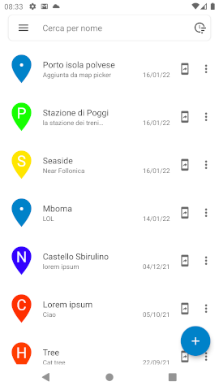
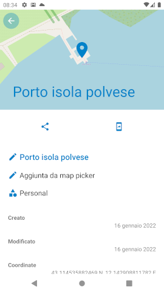
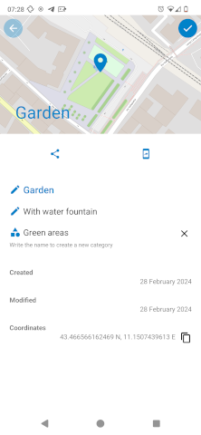

> This project was moved to [my private git server](https://git.ichibi.eu/penguin86/nextcloud-maps-client) . This repository may not be up to date.

# Nextcloud Maps Geofavorites Android app

(Always prefer [F-Droid](https://f-droid.org) build, when possible).

UNOFFICIAL and FOSS Nextcloud Maps client at its earliest stages of developement. Shows your Nextcloud Maps geofavorites in a list and a map.
Geofavorites can be opened in all apps supporting geo links (i.e. Google Maps, Organic Maps etc...).
A new geofavorite can be created on current location, by sharing a "geo:" uri from another app or manually picking from the map.

**Requires Maps app to be installed on the Nextcloud instance.**

This work is heavily based on [matiasdelellis's Nextcloud SSO example](https://github.com/matiasdelellis/app-tutorial-android) to implement [Nextcloud single sign on](https://github.com/nextcloud/Android-SingleSignOn).

            

## How to contribute

The project is open to contribution, but with some limits:

- I'm sorry I can't accept AI-generated contributions. Reviewing a contribution requires time and effort from my side, while generating code with AI requires very little time and produces non reliable code that must be reviewed in detail. This is effectively shifting the work on my side, and in a forced way. If you feel you need a feature but you're not able to implement it by yourself, I prefer you to create an issue in the repository so I can implement it when I can, in a more mantainable way.
- Before implementing a big change, please contact me to ensure it goes in the project's direction.

To contribute, you'll have to create an account on the git instance https://git.ichibi.eu. Unfortunately, I had to disable registration to avoid huge waves of fake accounts created by bots.
You can request an account writing to daniele.verducci@ichibi.eu
