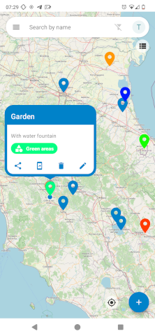

# Nextcloud Maps Geobookmarks Android app

Android app to show your Nextcloud Maps geobookmarks list. Geobookmarks can be opened in all apps supporting geo links (i.e. Google Maps, Organic Maps etc...).
A new geobookmark can be created on current location.

**Requires Maps app to be installed on the Nextcloud instance.**

This work is heavily based on [matiasdelellis's Nextcloud SSO example](https://github.com/matiasdelellis/app-tutorial-android) to implement [Nextcloud single sign on](https://github.com/nextcloud/Android-SingleSignOn).

      

Download it from [the releases page](https://github.com/penguin86/nextcloud-maps-client/releases)

