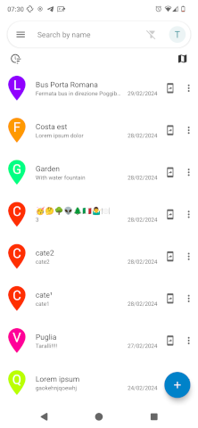

# Nextcloud Maps Geofavorites Android app

(Always prefer [F-Droid](https://f-droid.org) build, when possible).

UNOFFICIAL and FOSS Nextcloud Maps client at its earliest stages of developement. Shows your Nextcloud Maps geofavorites in a list and a map.
Geofavorites can be opened in all apps supporting geo links (i.e. Google Maps, Organic Maps etc...).
A new geofavorite can be created on current location, by sharing a "geo:" uri from another app or manually picking from the map.

**Requires Maps app to be installed on the Nextcloud instance.**

This work is heavily based on [matiasdelellis's Nextcloud SSO example](https://github.com/matiasdelellis/app-tutorial-android) to implement [Nextcloud single sign on](https://github.com/nextcloud/Android-SingleSignOn).

            

